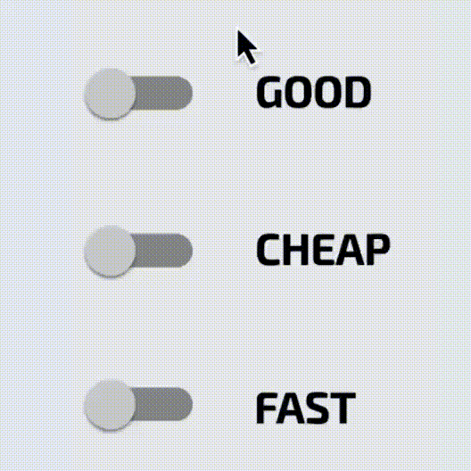

# AgiliExercise n°2
Pour mes étudiant(s). Exercice d'apprentissage de JavaScript

---

 

Les instructions pour la réalisation de ce TP sont simples :

Clonez ce dépôt dans votre répertoire de travail et ouvrez-le dans votre éditeur de code préféré.
L'interface est déjà prête, cependant, il faut encore ajouter les fonctionnalités. Pour cela, vous devez modifier le fichier main.js et le fichier main.css.

## Les résultats attendus sont les suivants :

À l'aide des connaissances que vous avez acquises jusqu'à présent, vous devez réaliser l'effet suivant :

Le principe est celui du triangle des possibles :

- un produit de qualité pas cher ne pas être livré rapidement
- un produit de qualité livré rapidement sera cher
- un produit pas cher livré rapidement sera de qualité médiocre

---

## Comment rendre ta réalisation ?
1. Publie ton code dans un dépôt GitHub public et envoie-moi le lien du TP.
2. Déploie également le projet sur GitHub Pages

### Conseils
Rédige ton algorithme, fais des recherches sur le web, parcours mes dépôts GitHub et surtout lis la documentation MDN.